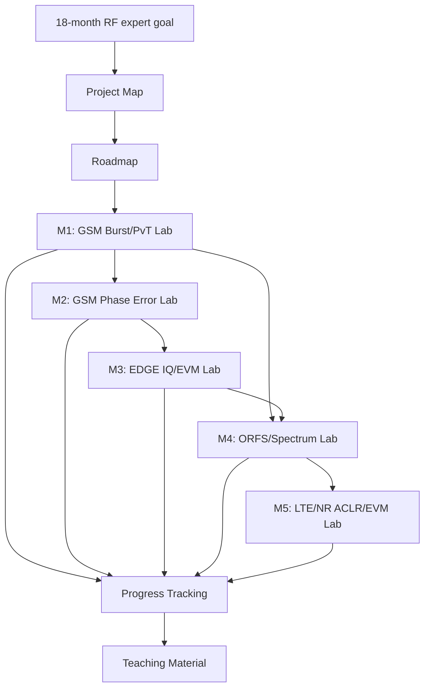

# Project Map

Last updated: 2026-07-15

## North Star

Become a senior-level Multi-Mode(GSM/EDGE/LTE/NR) Mid/High Band RF Frontend Module engineer within 18 months.

The project should help Mark:

- Explain RF principles from first principles, not only operate measurement equipment.
- Compare GSM/EDGE/LTE/NR requirements mode by mode.
- Connect waveform behavior, measurement results, design trade-offs, and production test decisions.
- Build visual learning tools that can also become teaching material for junior engineers.

## Learner Context

Current profile:

- Role: RF Frontend Module(PAMiD/L-PAMiD) development
- Level: mid-level engineer
- Strengths: measurement/test automation, production test, 3GPP specification understanding
- Growth areas: design tool fluency, principle-based understanding, technical communication
- Team context: small RF team
- Product scope: Multi-mode PA+ASM+LNA module, 1.4-2.7 GHz, GSM/LTE/NR

## Product Vision

RF Study Lab is a web-based study environment where each RF topic becomes:

- a concise learning note
- a visual simulator
- an understanding test or challenge
- a reusable teaching artifact

The first version should feel like a practical RF lab bench: dense enough for engineering work, visual enough for learning, and structured enough to grow for 18 months.

## RF Competency Map

Levels are tracked in `docs/PROGRESS.md`.

| Domain | Current baseline | 18-month target | Evidence to collect |
| --- | ---: | ---: | --- |
| GSM/EDGE fundamentals | 2 | 5 | Explain GMSK, 8-PSK, burst timing, PvT, Phase Error, EVM |
| LTE/NR fundamentals | 2 | 5 | Explain OFDMA/SC-FDMA, PAPR, ACLR, SEM, EVM, EN-DC |
| Multi-mode comparison | 1 | 5 | Compare mode requirements and design trade-offs clearly |
| RF measurement judgment | 3 | 5 | Diagnose failures from plots, logs, and test data |
| Production test optimization | 3 | 5 | Propose multi-mode test flow and time reduction strategy |
| PA/FEM design principles | 1 | 4 | Explain bias, matching, linearity, efficiency, thermal effects |
| Technical communication | 1 | 5 | Teach a junior engineer using visual material and examples |

## Learning Module Map

Initial module sequence:

| Module | Topic | Main learning outcome | App artifact |
| --- | --- | --- | --- |
| M1 | GSM Burst/PvT Lab | Understand GSM slot timing, ramp profile, power mask pass/fail | Time-domain simulator and parameter challenge |
| M2 | GSM Phase Error Lab | Understand phase trajectory and modulation quality | Phase error visualizer |
| M3 | EDGE IQ/EVM Lab | Compare GMSK vs 8-PSK and understand amplitude/phase error | Constellation and EVM simulator |
| M4 | ORFS/Spectrum Lab | Connect switching/modulation/nonlinearity to spectrum failures | Spectrum mask visualizer |
| M5 | LTE/NR ACLR/EVM Lab | Understand PAPR, RB allocation, linearity, and DPD/APT/ET impact | OFDM-style measurement simulator |
| M6 | Multi-Mode Mode Switching Lab | Understand bias/control transition, glitch, and settling | State-machine and timing visualizer |

## App Feature Map

| Feature area | Purpose | Initial state |
| --- | --- | --- |
| Learning notes | Explain concepts with Korean text and RF English terms | M1 validated |
| Visual simulators | Make time/frequency/IQ-domain behavior visible | M1 PvT validated |
| Parameter challenges | Train understanding through prediction and first/worst reading | M1 validated |
| Troubleshooting cases | Practice diagnosis from symptoms and plots | Six M1 cases validated |
| Progress tracking | Track distinct competency evidence and module completion | Local v3 validated |
| Data import | Compare simulated behavior with measurement data | Idea |
| Teaching mode | Create clean visual outputs for explaining to others | M1 print snapshot validated |

## Module Relationship

## Growth Rule

Every new feature should answer three questions before implementation:

1. Which RF competency does it improve?
2. What visual or interactive experience makes the concept easier to understand?
3. How will we know the learner understood it?
